# C-Cpp-for-win
this repository tells how to creat a c or cpp templete for win in vscode

## 1 参考链接

[MinGW-w64的安装及配置教程](https://blog.csdn.net/didi_ya/article/details/111240502)

[VSCode c++环境配置](https://blog.csdn.net/weixin_45743271/article/details/119869412)

[网盘下载mingw64](https://pan.baidu.com/s/1khNn3VDrl1WwFMerfbk7HQ?pwd=18zx)

## 2 安装扩展

VScode本身只是一款文本编辑器而已，所有功能都是以插件扩展的形式所存在，选择活动栏上的扩展视图图标或使用键盘快捷键(Ctrl+Shift+X)，搜索C++，点击安装即可

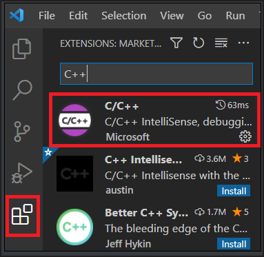

## 3 安装编译器

C/C++扩展不包括C++编译器或调试器

### 3.1 首先检查是否已安装编译器

检查GCC编译器g++：

**g++ --version**

检查Clang编译器clang：

**clang --version**

没有安装以上两种编译器的结果如下：

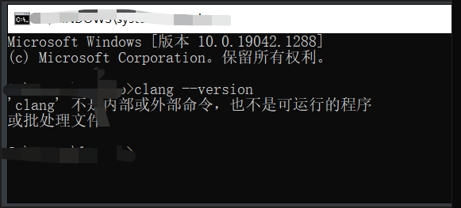

### 3.2 安装MinGW-x64（如果没有编译器）

MinGW的全称是：Minimalist GNU on Windows，它实际上是将经典的开源 C语言编译器GCC移植到了Windows平台下，并且包含了Win32API，因此可以将源代码编译为可在Windows中运行的可执行程序，而且还可以使用一些Windows不具备的，Linux平台下的开发工具。一句话来概括：**MinGW就是GCC的Windows版本**

MinGW-w64与 MinGW的区别在于MinGW只能编译生成32位可执行程序，而MinGW-w64则可以编译生成64位或32位可执行程序，正因为如此，MinGW现已被MinGW-w64所取代，且MinGW也早已停止了更新，内置的GCC停滞在了4.8.1版本，而MinGW-w64内置的GCC则更新到了8.1.0版本（2020/12/15）

* 安装步骤：

1. 双击进入安装

   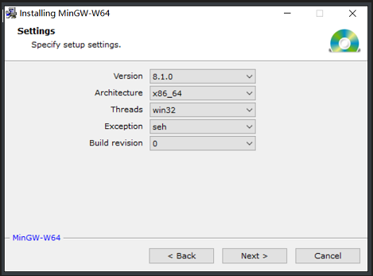

   - Version：指的是 gcc     的版本，如果没有特殊的需求，一般选择最高的版本号即可；在这个版本中，最高版本是8.1.0 ，选中它即可
   - Architecture：电脑系统架构，电脑系统是64位的，选择x86_64；如果是32位系统，则选择i686即可
   - Threads：操作系统接口协议，如果你想要开发Windows程序，需要选择win32，而开发     Linux、Unix、Mac OS等其他操作系统下的程序，则需要选择posix
   - Exception：异常处理模型，异常处理在开发中非常重要，在开发的过程中，大部分的时间会耗在处理各种异常情况上；seh是新发明的，而sjlj则是古老的，seh性能比较好，但不支持32位，sjlj稳定性好，支持32位；建议64位操作系统选择seh
   - Build revision：只能选0

2. 更改路径，一路next即可

3. 配置环境变量 右键此电脑–>属性–>高级系统设置–>环境变量–>设置系统变量

   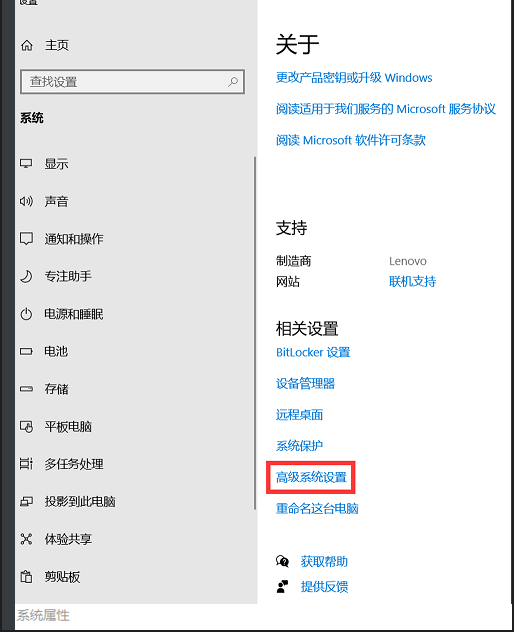

   

   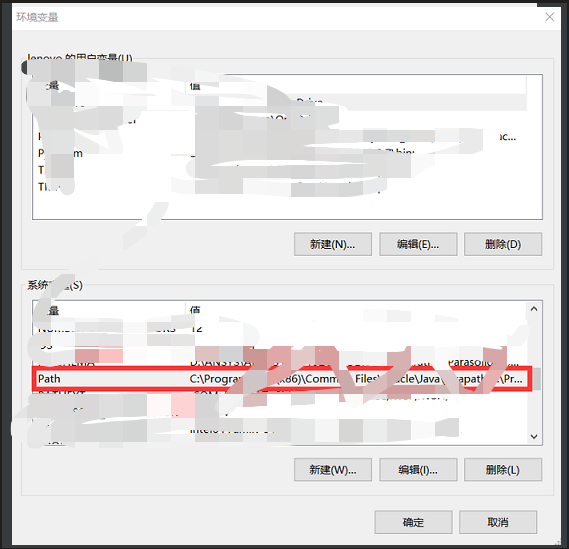

   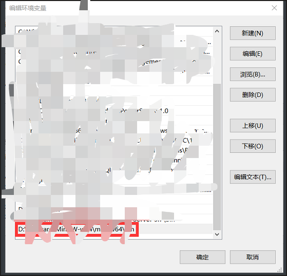

4. 验证安装 cmd中输入gcc -v并按回车键，将会显示MinGW-w64的组件列表：

   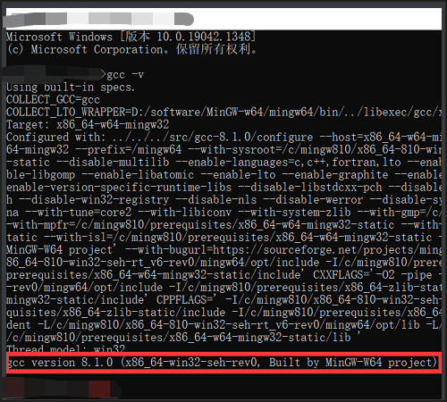

   如果“命令提示符”显示了一大串组件信息，说明MinGW-w64已经安装完成，就可以用MinGW-w64来编译C/C++了

## 4 vscode环境配置

### 4.1 创建工作区

在磁盘的工作目录新建一个文件夹，用来存放c/c++代码（不能是中文路径）

### 4.2 配置文件

在此文件夹下建立一个名为.vscode的文件夹，在.vscode文件夹中新建三个json文件注意名字必须一模一样：

> c_cpp_properties.json
>
> launch.json
>
> tasks.json

把如下代码复制到对应json文件中，修改对应内容，一般是需要改MinGW路径： 

**c_cpp_properties.json**

```json
{
    "configurations": [
        {
            "name": "Win32",
            "includePath": [
                "${workspaceFolder}/**"
            ],
            "defines": [
                "_DEBUG",
                "UNICODE",
                "_UNICODE"
            ],
            //此处是编译器路径，以后可直接在此修改
            "compilerPath": "G:/Software/VSCode/Cpp tools/x86_64-12.2.0-release-win32-seh-ucrt-rt_v10-rev2/mingw64/bin/g++.exe",
            "cStandard": "c11",
            "cppStandard": "c++17",
            "intelliSenseMode": "gcc-x64"
        }
    ],
    "version": 4
}
```

* 需要修改的地方：**compilerPath**修改成MinGW安装路径下面的bin/g++.exe

**launch.json**

```json
{
    // Use IntelliSense to learn about possible attributes.
    // Hover to view descriptions of existing attributes.
    // For more information, visit: https://go.microsoft.com/fwlink/?linkid=830387
    "version": "0.2.0",
    "configurations": [
        {
            "name": "(gdb) Launch",
            "preLaunchTask": "g++.exe build active file",//调试前执行的任务，就是之前配置的tasks.json中的label字段
            "type": "cppdbg",//配置类型，只能为cppdbg
            "request": "launch",//请求配置类型，可以为launch（启动）或attach（附加）
            "program": "${fileDirname}\\${fileBasenameNoExtension}.exe",//调试程序的路径名称
            "args": [],//调试传递参数
            "stopAtEntry": false,
            "cwd": "${workspaceFolder}",
            "environment": [],
            "externalConsole": true,//true显示外置的控制台窗口，false显示内置终端
            "MIMode": "gdb",
            "miDebuggerPath": "G:/Software/VSCode/Cpp tools/x86_64-12.2.0-release-win32-seh-ucrt-rt_v10-rev2/mingw64/bin/gdb.exe",
            "setupCommands": [
                {
                    "description": "Enable pretty-printing for gdb",
                    "text": "-enable-pretty-printing",
                    "ignoreFailures": true
                }
            ]
        }
    ]
}
```

* 需要修改的地方：**miDebuggerPath**修改成MinGW安装路径下面的bin/gdb.exe

**tasks.json**

```json
{
    // See https://go.microsoft.com/fwlink/?LinkId=733558 
    // for the documentation about the tasks.json format
    "version": "2.0.0",
    "tasks": [
        {
            "type": "shell",
            "label": "g++.exe build active file", //这里注意一下，见下文
            "command": "G:/Software/VSCode/Cpp tools/x86_64-12.2.0-release-win32-seh-ucrt-rt_v10-rev2/mingw64/bin/g++.exe",
            "args": [
                "-g",//以下添加多文件工程调用
                "${file}",
                "-o",
                "${fileDirname}\\${fileBasenameNoExtension}.exe"
            ],
            "options": {
                "cwd": "G:/Software/VSCode/Cpp tools/x86_64-12.2.0-release-win32-seh-ucrt-rt_v10-rev2/mingw64/bin"
            },
            "problemMatcher": [
                "$gcc"
            ],
            "group": {
                "kind": "build",
                "isDefault": true
            }
        }
    ]
}

```

* 需要修改的地方：修改**command**和**options**中的**cwd**

 

**4.3 使用**

使用时打开工作区文件夹（.vscode文件夹的上一级文件夹），在与.vscode文件夹同级或更低的目录下添加或执行c文件或cpp文件

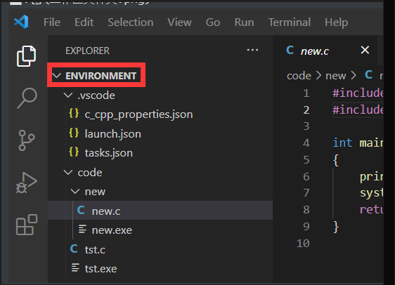

* 注意：打开的必须是Environment文件夹，不能直接打开.vscode

按F5调试（这里应该不需要额外选编译器了，已经在json文件里了），得到如下结果：

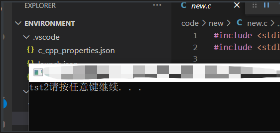

说明环境已经配置成功

### 4.4 多文件工程配置

在main.c所在的路径下新建2个c文件和2个h文件，直接按F5调试将会报错，需要在task.json中作出如下修改，告诉编译器需要链接哪些文件

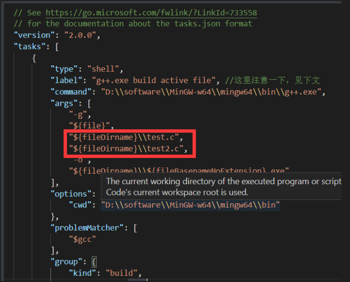

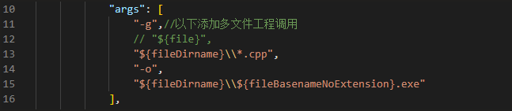

可以直接这样子


## 5 一些坑

vscode中运行的文件，路径不能带('），无法运行。

如：I'm fine 这个作为路径名就不行
